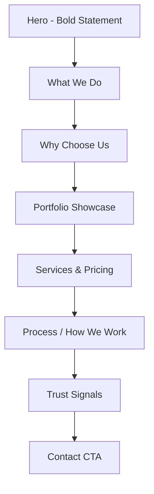

# Web Design Agency Page - Architecture Plan

## Executive Summary
Create a professional web design agency page within the baseFM ecosystem that showcases services and portfolio to win new clients. The page should leverage your existing technical expertise while presenting a compelling case for why clients should choose your team.

---

## 1. Target Audience

**Primary:**
- Small to medium businesses needing websites
- Startups looking for modern web presence
- Event promoters and nightlife brands
- Creative professionals and artists

**Secondary:**
- Agencies needing development support
- Non-profits seeking affordable web solutions

---

## 2. Value Proposition (Differentiation)

Based on your existing baseFM infrastructure, emphasize:

| Strength | Message for Clients |
|----------|---------------------|
| **Technical Excellence** | "We build the future" - demonstrated by your existing platforms (baseFM, AI Cloud, etc.) |
| **End-to-End Ownership** | From design to deployment - you own the full stack |
| **Modern Stack** | Next.js, Supabase, Web3 capabilities (unique selling point) |
| **Fair Pricing** | Direct relationships = no agency markup overhead |
| **Fast Delivery** | Iterative shipping - get live quickly |

---

## 3. Key Features to Win Customers

### 3.1 Portfolio Showcase (Critical)
- **Live Project Links**: Direct links to your existing properties (baseFM, AI Cloud dashboard, events)
- **Before/After Transformations**: Show website overhauls
- **Case Studies**: 2-3 detailed breakdowns showing:
  - Client challenge
  - Your solution
  - Results achieved
- **Tech Stack Badges**: Display technologies used (Next.js, Supabase, Tailwind, etc.)

### 3.2 Service Packages
```
┌─────────────────────────────────────────────────────────────┐
│  STARTER          PROFESSIONAL        ENTERPRISE           │
│  £999             £2,500+             Custom               │
│  ─────────        ───────────         ────────             │
│  5 pages          Full website        Custom build         │
│  Mobile-ready     CMS included        E-commerce           │
│  Contact form     SEO setup           API integrations     │
│  1 revision       3 revisions         Unlimited support   │
└─────────────────────────────────────────────────────────────┘
```

### 3.3 Trust Builders
- **"Our Work Speaks"** - Live demo links to your platforms
- **Tech Credentials** - Highlight your GitHub, open source contributions
- **Response Time Guarantee** - "We respond within 24 hours"
- **Satisfaction Promise** - "Changes until you're happy"

### 3.4 Lead Capture
- **Project Type Selector**: Dropdown (Brochure | E-commerce | Web App | Redesign)
- **Budget Range Slider**: Helps qualify leads
- **Timeline Picker**: Urgent / Flexible / Researching
- **Quick Contact**: Email or Telegram link

### 3.5 Social Proof
- Client testimonials (even from internal projects)
- "Trusted by" section with partner/vendor logos
- Community stats (e.g., "50+ artists on our platform")

---

## 4. Page Structure (Proposed)



### Section Details:

**Hero**
- Headline: "We Build Websites That Actually Work"
- Subheadline: "From concept to launch - fast, modern, designed to convert"
- CTA: "See Our Work" | "Get a Quote"

**What We Do**
- Web Development
- UI/UX Design  
- CMS Integration
- E-commerce
- API Development

**Why Choose Us**
- 4-5 bullet points with icons
- Emphasize: Speed, Modern Tech, Fair Pricing

**Portfolio**
- Grid of project cards with screenshots
- Hover effects showing tech stack
- Links to live sites

**Services**
- 3-tier pricing table
- Custom quote option

**Process**
- 4-step flow: Discovery → Design → Build → Launch

**Contact**
- Simple form or direct contact options

---

## 5. Technical Implementation

### Location
New route: `/agency/web-design` or expand existing `/agency` page with tabs

### Tech Stack (Same as baseFM)
- Next.js 14+ App Router
- Tailwind CSS (existing design system)
- TypeScript
- Client components for interactivity

### Components to Create
1. `HeroSection` - Main banner with CTAs
2. `ServiceCard` - Reusable service display
3. `PortfolioGrid` - Project showcase with filtering
4. `PricingTable` - 3-tier package display
5. `ProcessSteps` - How we work visualization
6. `LeadCaptureForm` - Project inquiry form
7. `TrustBadge` - Client logos/testimonials

### Integration Points
- Link to existing `/agency` page for cross-promotion
- Reuse existing layout components
- Consistent with current dark theme aesthetic

---

## 6. Winning Features Checklist

| Feature | Purpose | Priority |
|---------|---------|----------|
| Live portfolio links | Prove capability | Must Have |
| Clear pricing tiers | Reduce friction | Must Have |
| Fast contact method | Lower barrier | Must Have |
| Case studies | Build trust | Should Have |
| Tech stack showcase | Demonstrate expertise | Should Have |
| Before/after visuals | Show transformation | Could Have |
| Live chat widget | Instant engagement | Could Have |
| Project calculator | Qualify leads | Could Have |

---

## 7. Next Steps

1. **Approve this plan** - Confirm direction
2. **Gather assets** - Screenshots of existing projects
3. **Define pricing** - Finalise package details
4. **Switch to Code mode** - Begin implementation

---

## Questions for Clarification

- Should this be a new page `/web-design` or integrated into existing `/agency`?
- What is the target price range for your services?
- Do you have client testimonials to feature?
- Should I start implementing this page?
